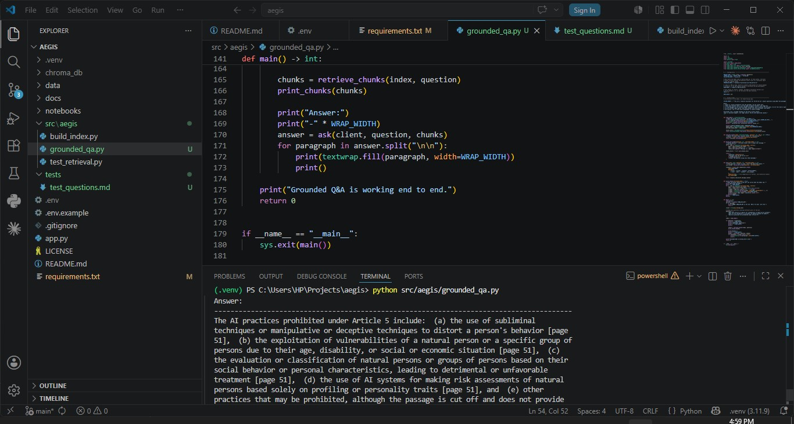

# Aegis build journey

This file is the human-readable history of the project. Each week gets a section with a date, what was built, what worked, what didn't, and a screenshot where one exists. The point is to leave a visible record so anyone reading the repo for the first time can scroll this file and follow the path from empty folder to live tool.

Code lives in the rest of the repo. This file is the story.

## Week 1 (29 May 2026)

Set up the project foundation. Python 3.11 virtual environment, project folder structure (`src/`, `data/`, `docs/`, `notebooks/`, `tests/`), a Streamlit Hello World page running at localhost:8501, `.gitignore`, `.env.example`, `LICENSE` (All Rights Reserved), and the README. Downloaded the six source PDFs into `data/`: the EU AI Act, Annex III (currently a duplicate of the Act, used for testing the slicing logic in a later week), the Irish General Scheme of the AI Regulation Bill 2026, and the three chapters of the GPAI Code of Practice (Transparency, Copyright, Safety and Security).

Local git repository initialised, public GitHub repo created at github.com/noble-chidera-onyema/aegis, first commit `3b7fb4c` pushed. Description and topic tags set for discoverability.

No screenshot for Week 1. The build was completed before this journey log existed.

## Week 2 (30 May 2026, the day after Week 1)

Built the retrieval pipeline. Indexed `ai_act.pdf` (144 pages) into 296 chunks of around 800 characters each with 100-char overlap, generated a 384-dimensional embedding for each chunk using `sentence-transformers/all-MiniLM-L6-v2`, and wrote the vectors to a local Chroma collection at `chroma_db/ai_act_v1`. Wrote a smoke test at `src/aegis/test_retrieval.py` that runs three sample queries against the index and prints the top three chunks per query with page number and similarity score.

Honest limitations at this stage. pypdf introduces letter-spacing artefacts on the CELEX-format PDF ("high-r isk", "Ar ticle"). Top-3 similarity scores currently sit in the 0.36 to 0.53 range, which is the loosely-related band rather than the strongly-relevant band. Query 3 ("Which AI practices are prohibited under the Act?") did not return Article 5 in the top three results, which is a real miss. All three issues are noted for the Week 8 evaluation harness, where the embedding model, PDF extraction library, and hybrid-search options get decided based on measured numbers rather than vibes.

The screenshot shows the project file tree on the left, the `test_retrieval.py` source code in the editor, the terminal output proving end-to-end retrieval works, and the git commit being made with the honest commit message naming the limitations.

Note on dates. Week 2 was built 30 May 2026, one day after Week 1, not after a full calendar week. The work was done in a single extended overnight session. Future weeks will not all be this compressed.

## Week 3 (31 May 2026, two days after Week 2)

Built the grounded question-and-answer layer on top of the Week 2 retrieval pipeline. The script in `src/aegis/grounded_qa.py` takes a question, retrieves the top five passages from the Chroma index, sends them to Groq with Llama 3.3 70B, and prints an answer that quotes the passages with `[page N]` citations. A system prompt constrains the model to answer only from the retrieved passages, refuse when the passages do not cover the question, and end every answer with the disclaimer line "This is decision-support, not legal advice. Verify with qualified counsel."

A planning detail worth recording. The locked spec was built around 6 to 12 hours per week. The build pace has been faster, with Week 1, Week 2, and Week 3 completed across 29, 30, and 31 May. The dates in this log reflect what actually happened, not the original schedule.

One non-trivial decision during the build. The `llama-index-llms-groq` wrapper that works with the current `llama-index-core==0.14.22` pins an older `transformers` library, which would force a downgrade of `sentence-transformers` and break Week 2 retrieval. The project calls Groq's official Python SDK directly instead. Retrieval still uses LlamaIndex. The LLM call is now `groq_client.chat.completions.create(...)` with a hand-written prompt template. This trades a small convenience for transparency, a simpler dependency tree, and prompt-template control the Week 4 risk classifier needs.

Three sample questions, hand-checked against the source document. Article 13 transparency obligations: retrieved passages from pages 21, 34, 35, 46, 114; answer cited page 21 consistently; honest that the full text of Article 13 was not in the top-5 chunks. General-purpose AI obligations: retrieved passages from pages 26, 27, 31, 67, 85; answer cited pages 31 and 85; covered the authorised-representative requirement. Article 5 prohibited practices: retrieved passages from pages 4, 8, 12, 51; top passage was Article 4 (literacy), not Article 5; the model produced a correct list of four Article 5 prohibitions citing page 51, but used a combination of one partial passage and its training knowledge of the Act. This partial-grounding case is flagged in `tests/test_questions.md` for the Week 8 evaluation harness.

The screenshot shows the project file tree with `grounded_qa.py` and `test_questions.md` in place, the editor on the closing lines of the main function, and the terminal output of the Article 5 answer with `[page 51]` citations on each prohibited practice.

Known limitations carrying forward. pypdf still produces letter-spacing artefacts in the retrieved text ("high-r isk", "Ar ticle"); the model is robust to this in its outputs but the chunks remain noisy. Top-5 retrieval is the current setting; Week 8 will test 3, 5, and 10 against a hand-labelled set. The Article 5 partial-grounding case shows the model occasionally fills gaps with general knowledge of the Act; citation accuracy testing in Week 8 will quantify how often this happens. All similarity scores still sit in the 0.35 to 0.50 band.

## Week 4 (1 June 2026, one day after Week 3, after a rest day)

Built the risk classifier. The module at `src/aegis/classify.py` takes a plain-language description of an AI system and returns a structured `Classification` object with five fields: `tier` (one of prohibited, high-risk, limited-risk, minimal-risk), `confidence` (high, medium, low), `reasoning` (a 3 to 6 sentence paragraph grounded in the retrieved passages), `citations` (a list of Article and Annex references with page numbers), and `needs_human_review` (a boolean for the Week 7 HITL banner). The Week 6 Streamlit UI will import `classify_system()` directly.

Module-first build, not CLI-first. The same file exposes a `main()` entry point for development testing under `if __name__ == "__main__":`, so today's runnable demonstration and the Week 6 UI both call the same function. One source of truth for the classification logic. Same shape as the existing `build_index.py` and `grounded_qa.py`, but with the public/private split made explicit.

Four design decisions worth recording.

`temperature=0.0` for classification, against `0.1` for Q&A. The same description should always get the same tier across runs. Determinism is the point. Q&A can afford a small amount of latitude in phrasing; classification cannot.

`response_format={"type": "json_object"}` uses Groq's JSON mode. The model is constrained to return parseable JSON. The defensive `_parse_response()` function still has fallbacks for malformed output and unrecognised tier names, but JSON mode prevents those paths from firing in practice.

The retrieval query is augmented. Even when a system description does not mention "high-risk", "Annex III", "Article 5", or "transparency", the retrieval query appends those terms before searching. Without this, descriptions of clearly prohibited or high-risk systems can fail to surface the right Articles. This is a small but meaningful RAG technique.

`needs_human_review` exists in the data model from day one. It is the seed for the Week 7 human-in-the-loop banner. Building it in now rather than retrofitting it later means the UI layer in Week 6 can read it without schema changes.

Four hand-checked test cases, one per tier, run on 1 June 2026. All four matched their expected tier with high confidence: hiring CV screener (high-risk, Annex III(4)(a), page 130 and Article 6 page 53), customer service chatbot (limited-risk, Article 50 page 97), social scoring system (prohibited, Article 5), internal spam filter (minimal-risk, ruled out each higher tier in turn). Detailed observations in `tests/test_classifications.md`.

Two real defects observed and recorded honestly.

Citation formatting is inconsistent. When the model classifies a system INTO a tier, it cites with real page numbers (e.g. "Annex III, page 130"). When it rules a tier OUT, it cites the Article generically without a page (e.g. "Article 50, page not specified"). All four cases show this pattern. The fix is likely a tighter prompt template; flagged for the Week 8 evaluation harness.

`needs_human_review` returned false on all four cases. For three of them this is correct. For the CV screener it is debatable; the boundary between "AI-assisted ranking" and "AI-driven decision-making" is contested in practice, and a real compliance officer would still flag a CV screener for legal review. The classifier is more confident than the underlying legal position warrants for borderline cases. Week 8 evaluation will measure how often this happens and tune the prompt with explicit "flag for review" criteria.

The screenshot shows the project file tree with `classify.py` and `test_classifications.md` in place, and the terminal output of the CV screener classification with `Tier: high-risk`, `Confidence: high`, grounded reasoning citing Annex III and Article 6, page-numbered citations, and the `Expected: high-risk   Got: high-risk   (match)` line.

A note on pace. Weeks 1, 2, and 3 were built on three consecutive days (29, 30, 31 May). 1 June started as a rest day in the morning and turned into the Week 4 build in the afternoon. The dates in this log reflect what happened, not the original spec's 6-to-12-hours-per-week cadence. Weeks 5 through 11 will not all move at this pace; the harder weeks (UI in Week 6, privacy and accessibility in Week 7, evaluation harness in Week 8, real-user testing in Week 10) need more thought and more wall-clock time.

## Up next

Week 5, obligations and gap report. Take a tier returned by the Week 4 classifier and map it to the specific obligations that apply, then turn those obligations into a plain-language checklist showing where a described AI system is and is not yet compliant. This is what an SME compliance officer actually needs on screen: not just "you are high-risk" but "you are high-risk and here is what you need to do about it before 2 August 2026."
---

## Week 5 (2 June 2026) — Obligations report and the chunking root-cause fix

Goal: produce an obligations report that, for any classified AI system,
returns the applicable Articles with citations a user can verify against
the source PDF.

### What got built

`src/aegis/obligations.py` implements a three-layer architecture:

1. Hardcoded obligation specifications, keyed by tier. Article number,
   title, description, compliance level, and checklist question for
   every operative Article that maps to a tier. Auditable, no LLM.
2. Source passages retrieved from the Chroma index, looked up by
   `article_number` metadata. Verifiable against the source PDF.
3. Per-system "applies_because" notes generated by Groq Llama 3.3 70B,
   explaining why each Article applies to the specific system being
   classified. Clearly distinguished from the hardcoded layer.

Defense in depth: the hardcoded specs and the source passages stay
correct even if the LLM layer fails or hallucinates. The disclaimer
"This is decision-support, not legal advice" prints with every report.

### Citation accuracy: three heuristic attempts that did not work

The first version of `find_source_passage` retrieved Article text via
semantic search. Every Article query returned the same chunk (page 78)
because Chroma's embeddings score all "Article N" queries similarly.

Attempt 1: substring search with a position heuristic (first chunk where
"Article N" appears within the first 200 characters wins). Got 7 of 11
correct, but recital cross-references won for Articles 11, 13, 15.

Attempt 2: regex header pattern matching `Article N <Capital>` with a
preference for chunks from the operative-Articles page range. Got 3 of
11 correct. Annex III chunks (page 130) matched the same pattern.

Attempt 3: position + density scoring (lowest combined score wins,
where density counts other Article references in the chunk). Got 3 of
11 correct, same Annex III problem inverted.

At this point, "engineering judgement" said: time-box, document the
limitation, ship. The senior call was to stop and find the root cause
instead.

### The diagnostic step

Inspection of Chroma showed the operative Article 9 chunk was not in
the index at all. Of 14 chunks containing the string "Article 9", every
single one was a cross-reference (recitals, other Articles, Annexes).
The Article 9 header line had been chopped off by a chunk boundary and
sat alone at the end of an Article 8 chunk, while the Article 9 body
text became a chunk that never mentioned "Article 9" anywhere.

This was a chunking bug, not a search bug. No regex on the chunks could
find what was not in any chunk.

### The architecture fix

Rewrote `src/aegis/build_index.py` as an Article-aware splitter:

1. Switched extraction from pypdf to pdfplumber. pdfplumber preserves
   text positions and avoids letter-spacing artefacts on CELEX-format
   legal PDFs. This is the prerequisite for header detection.
2. Regex `^Article\s+(\d+)\s*$` with MULTILINE detects Article header
   lines reliably (Articles begin on their own line in the Act).
3. Split the document on Article boundaries. Each Article becomes its
   own chunk along with its header. Articles longer than 1500 chars
   sub-chunk further, each sub-chunk keeping the parent Article number.
4. Tag each chunk with `article_number` and `sub_chunk_index` metadata.
   Citation lookup is now `collection.get(where={"article_number": N,
   "sub_chunk_index": 0})`. Five lines instead of fifty.

### Result

11 of 11 page citations land on the operative Article's actual page,
audited against `data/ai_act.pdf`. See `tests/test_obligations.md`.

### What this retires

- pypdf letter-spacing artefacts (Week 2 known limit)
- Citation lookup heuristics (three attempts this week)
- The implicit assumption that semantic retrieval would handle Article
  lookup. It will not, for documents where every Article query embeds
  similarly. Metadata filtering is the right tool.

### What stays open for Week 8

The Article-header regex detected 114 headers when the Act has 113
operative Articles. One extra was likely a table-of-contents entry or
numbering edge case. Does not affect citation correctness on the 11
audited Articles. Worth investigating during the formal evaluation
harness.

## Week 6 — Streamlit interface (built 3-4 June 2026)

A note on timing. The build plan is organised into 11 units called "weeks." They are units of scope, not calendar weeks. Week 5 and most of Week 6 were built on 3 June 2026, and this closeout was done on 4 June. I am completing the planned work faster than one unit per calendar week. The "Week N" labels track the plan, not elapsed time.

### What this week covered

Week 6 wires the four-screen Streamlit UI to the Week 2-5 backend: an inventory form, a classification result screen, the obligations report, and a grounded Q&A tab. The backend logic already existed and was tested in earlier weeks. This week was about connecting it to something a non-technical user can click through, and making it hold together when things go wrong.

Single-file app.py using st.tabs for the four screens. Shared state across tabs via st.session_state, so a system classified on the Inventory tab carries through to Classification and Obligations without re-entering anything. The backend objects (embedding model, Chroma index, Groq client) load once per process through st.cache_resource rather than on every interaction.

### Design

Institutional document aesthetic, not a typical AI-app look. Lora for headings, Source Sans 3 for body, IBM Plex Mono for citations, all Google Fonts chosen deliberately to avoid the Inter/Roboto default that signals "another LLM wrapper." Tier colours are muted and legal-document-like rather than traffic-light bright. The full rationale is in docs/DESIGN_BRIEF.md.

### The debugging this actually took

This week was not clean. Worth recording honestly because the failures are where the work was.

The Ask tab crashed on first wiring because app.py imported a function name that did not exist. The grounded_qa module exposes lower-level pieces (load_index, retrieve_chunks, ask) rather than a single entry point, so the app had to assemble the retrieve-then-ask pipeline itself.

Four display bugs in sequence, all the same root cause: Streamlit's default dark-mode styling leaking through the light theme. Dark input boxes, faint body text, pale alert boxes, and chat bubbles rendering grey and pink with invisible text. Each fixed by forcing explicit colours on the relevant Streamlit test-id selectors.

The obligation AI-notes first rendered as raw HTML tags instead of styled boxes. Streamlit's markdown renderer treats indented multi-line HTML as a code block and escapes it. Fixed by assembling each card as a single flat HTML string with no indentation.

### The retrieval problem, and why I did not defer it

Once the Q&A tab worked mechanically, the answers were wrong in a specific way. "What does Article 13 require?" returned "the passages do not contain information about Article 13," which is false, Article 13 is in the Act. Diagnosis: semantic search on a question that names a specific Article embeds toward generic obligation language and misses the named Article. The fix reuses the Week 5 mechanism: detect an Article number in the question, retrieve that Article's chunks by metadata filter, fall back to semantic search when no Article is named. Article 13 then returned a correct, cited answer.

A second, harder case: "What makes an AI system high-risk?" This names no Article, so it took the semantic path, and the answer was weak ("not explicitly defined in the provided passages") with a meaningless page 1 citation. Rather than defer this to the Week 8 evaluation harness, I traced it. Two findings from inspecting the retrieved chunks at their similarity scores:

1. Article 6 (the classification rule, page 53) is in the index and does answer the question, but semantic search ranked it seventh, below the top-5 cutoff.
2. The recital and front-matter chunks (tagged article_number=0, page 1 by the Week 5 splitter) are generic preamble prose that embeds close to almost any conceptual query. They occupied three of the top five slots and cited a meaningless page 1.

The fix has two parts. Exclude the article_number=0 recital chunks from semantic retrieval, which lifts the real Articles into the top results. And add classification-intent routing, so a "high-risk" or "classification" question leads with Article 6. The high-risk question now returns a correct answer quoting Article 6's two-condition test, the Annex III extension, and the Article 7 power for the Commission to amend Annex III by delegated act. Page citations were verified against the source PDF: the Annex III amendment power is Article 7(1), printed page 54, which matches the answer's citation.

Both retrieval paths were verified in the terminal before wiring into the app, to prove the fix without spending the day's limited API quota on UI round-trips.

### Honest scope boundary

The named-Article and classification-intent paths now give correct, well-cited answers. General conceptual questions that name no Article and match no intent pattern still rely on plain semantic search, with recitals excluded. That path's quality across a wide range of questions is what the Week 8 evaluation harness will measure and tune systematically, with a labelled question set rather than one question at a time. Fixing retrieval quality by hand, one question at a time, would produce a green result and teach nothing measurable. The systematic work stays in Week 8 where it belongs.

### Resilience

Every screen runs its backend call inside an error boundary that logs the full traceback to the console and shows the user a plain message with their inputs preserved. This was tested under a real failure: the free-tier Groq daily token limit was reached during heavy testing, and the boundary caught every 429 cleanly rather than freezing the app.

### Model configuration

GROQ_MODEL is now read from the environment, defaulting to llama-3.3-70b-versatile. This satisfies the spec's config-flagged-model requirement and lets the Week 8 evaluation runs use the cheaper llama-3.1-8b-instant without a code change, by setting GROQ_MODEL in .env.

### State at end of Week 6

All four screens work end to end. Classification, the full ten-article obligations report with correct page citations, and both Q&A paths return correct, cited answers. Screenshots: week06_obligations_report.jpg and week06_ask_grounded_answer.jpg in docs/build_journey/.